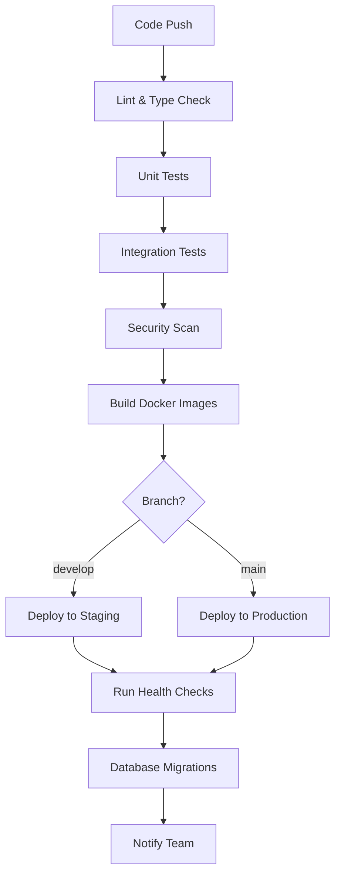

# BarberPro CI/CD Pipeline & Deployment Guide

## Table of Contents
- [Overview](#overview)
- [CI/CD Pipeline Architecture](#ci-cd-pipeline-architecture)
- [Environment Setup](#environment-setup)
- [Docker Deployment](#docker-deployment)
- [Railway Deployment](#railway-deployment)
- [Database Management](#database-management)
- [Monitoring & Alerts](#monitoring--alerts)
- [Troubleshooting](#troubleshooting)
- [Rollback Procedures](#rollback-procedures)

## Overview

BarberPro uses a comprehensive CI/CD pipeline optimized for Argentina deployment with Railway as the primary platform and Docker containers for flexibility.

### Key Features
- **Multi-environment support**: Development, Staging, Production
- **Argentina-optimized deployment**: Railway platform with SA-East region
- **Docker containerization**: Multi-stage builds for optimal performance
- **Automated testing**: Unit, integration, and E2E tests
- **Security scanning**: Vulnerability and dependency auditing
- **Database migrations**: Automated Prisma migrations
- **Hotfix deployment**: Critical bug fix pipeline
- **Environment validation**: Comprehensive configuration checks

## CI/CD Pipeline Architecture

### Pipeline Stages



### Workflow Triggers
- **Push to main**: Production deployment
- **Push to develop**: Staging deployment
- **Push to feature/***: Testing only
- **Pull requests**: Full validation pipeline
- **Manual dispatch**: Environment-specific deployment
- **Commit with "HOTFIX"**: Emergency deployment

## Environment Setup

### Required Secrets

#### GitHub Secrets
```bash
RAILWAY_TOKEN                    # Railway CLI authentication
SLACK_WEBHOOK_URL               # Team notifications
STAGING_DATABASE_URL            # Staging database connection
PRODUCTION_DATABASE_URL         # Production database connection
STAGING_SENTRY_DSN             # Staging error tracking
PRODUCTION_SENTRY_DSN          # Production error tracking
```

#### Railway Environment Variables

##### Staging Environment
```bash
DATABASE_URL                    # Auto-generated by Railway
REDIS_URL                      # Auto-generated by Railway
JWT_SECRET                     # Strong random secret
AWS_ACCESS_KEY_ID              # S3 file uploads
AWS_SECRET_ACCESS_KEY          # S3 file uploads
MERCADOPAGO_SANDBOX_ACCESS_TOKEN # Payment testing
MERCADOPAGO_SANDBOX_PUBLIC_KEY  # Payment testing
MERCADOPAGO_WEBHOOK_SECRET     # Payment webhooks
SMTP_USER                      # Email notifications
SMTP_PASS                      # Email notifications
SENTRY_DSN                     # Error tracking
NEWRELIC_LICENSE_KEY           # Performance monitoring
```

##### Production Environment
```bash
DATABASE_URL                    # Auto-generated by Railway
REDIS_URL                      # Auto-generated by Railway
JWT_SECRET                     # Production-grade secret
AWS_ACCESS_KEY_ID              # S3 file uploads
AWS_SECRET_ACCESS_KEY          # S3 file uploads
MERCADOPAGO_ACCESS_TOKEN       # Production payments
MERCADOPAGO_PUBLIC_KEY         # Production payments
MERCADOPAGO_WEBHOOK_SECRET     # Payment webhooks
SMTP_USER                      # Production email
SMTP_PASS                      # Production email
SENTRY_DSN                     # Production error tracking
NEWRELIC_LICENSE_KEY           # Performance monitoring
DATADOG_API_KEY                # Advanced monitoring
WHATSAPP_TOKEN                 # WhatsApp Business API
AFIP_CUIT                      # Argentina tax integration
FACEBOOK_APP_ID                # Social media integration
GOOGLE_PLACES_API_KEY          # Location services
```

### Environment Validation

```bash
# Validate all environments
./scripts/validate-env.sh development
./scripts/validate-env.sh staging
./scripts/validate-env.sh production
```

## Docker Deployment

### Multi-Stage Docker Build

The project uses optimized multi-stage Docker builds:

```dockerfile
# Production targets available:
# - backend-production: Standalone backend
# - frontend-production: Standalone frontend (Nginx)
# - production: Full-stack application (default)
```

### Building Images Locally

```bash
# Build backend
docker build -f backend/Dockerfile --target production -t barberpro-backend .

# Build frontend
docker build -f frontend/Dockerfile --target production -t barberpro-frontend .

# Build full-stack
docker build --target production -t barberpro-fullstack .
```

### Docker Compose Deployment

```bash
# Development
docker-compose up -d

# Production
docker-compose -f docker-compose.production.yml up -d

# View logs
docker-compose logs -f

# Scale services
docker-compose up -d --scale backend=2
```

### Container Health Checks

All containers include health checks:
- **Backend**: `curl http://localhost:3000/api/health`
- **Frontend**: `curl http://localhost:80/health`
- **Database**: `pg_isready -U barberpro`
- **Redis**: `redis-cli ping`

## Railway Deployment

### Project Structure

```
barberpro-staging/
├── backend (Node.js service)
├── frontend (Static site)
├── postgresql (Database)
└── redis (Cache)

barberpro-production/
├── backend (Node.js service)
├── frontend (Static site)
├── postgresql (Database)
└── redis (Cache)
```

### Manual Deployment

```bash
# Install Railway CLI
curl -fsSL https://railway.app/install.sh | sh

# Login
railway login

# Deploy to staging
railway environment staging
railway up --service backend
railway up --service frontend

# Deploy to production
railway environment production
railway up --service backend
railway up --service frontend
```

### Environment Configuration

Railway uses template variables: `${{Railway.VARIABLE_NAME}}`

Example configuration:
```bash
DATABASE_URL=${{Railway.DATABASE_URL}}
JWT_SECRET=${{Railway.JWT_SECRET}}
SENTRY_DSN=${{Railway.SENTRY_DSN}}
```

### Domain Configuration

#### Staging
- **API**: https://staging-api.barberpro.com.ar
- **App**: https://staging.barberpro.com.ar

#### Production
- **API**: https://api.barberpro.com.ar
- **App**: https://barberpro.com.ar

## Database Management

### Migration Strategy

```bash
# Development
npx prisma migrate dev --name feature_name

# Staging/Production
npx prisma migrate deploy
```

### Automated Migrations

The CI/CD pipeline handles migrations automatically:

1. **Staging**: Migrations run after deployment
2. **Production**: Migrations run after deployment with validation
3. **Rollback**: Automated rollback on migration failure

### Database Backup

```bash
# Manual backup
./scripts/backup-database.sh production

# Automated backups (production)
# - Daily at 2 AM Argentina time
# - 30-day retention
# - S3 storage in sa-east-1
```

### Database Monitoring

- **Connection pooling**: 5-20 connections (production)
- **Query monitoring**: Prisma query logging
- **Performance alerts**: Slow query detection
- **Health checks**: Automated connection testing

## Monitoring & Alerts

### Error Tracking (Sentry)
- **Staging**: Debug level logging
- **Production**: Warning level logging
- **Real-time alerts**: Critical errors
- **Performance monitoring**: Transaction tracking

### Application Performance (New Relic)
- **Response time monitoring**: <200ms target for Argentina
- **Database performance**: Query optimization
- **Memory usage**: Leak detection
- **Custom dashboards**: Argentina-specific metrics

### Infrastructure Monitoring (DataDog)
- **Server metrics**: CPU, memory, disk
- **Application metrics**: Custom business metrics
- **Log aggregation**: Centralized logging
- **Alerts**: Performance degradation

### Health Check Endpoints

```bash
# Backend health
curl https://api.barberpro.com.ar/api/health

# Database health
curl https://api.barberpro.com.ar/api/health/database

# Redis health
curl https://api.barberpro.com.ar/api/health/redis

# Full system health
curl https://api.barberpro.com.ar/api/health/system
```

## Troubleshooting

### Common Issues

#### 1. Deployment Failures

```bash
# Check Railway logs
railway logs --environment production

# Check CI/CD pipeline
# Navigate to GitHub Actions for detailed logs

# Validate environment
./scripts/validate-env.sh production
```

#### 2. Database Connection Issues

```bash
# Check database status
railway status --environment production

# Test connection
psql $DATABASE_URL -c "SELECT 1;"

# Reset connection pool
railway restart --service backend
```

#### 3. Performance Issues

```bash
# Check application metrics
# New Relic dashboard

# Database performance
# Check slow query logs

# Memory usage
# Monitor container resources
```

#### 4. Failed Migrations

```bash
# Check migration status
npx prisma migrate status

# Resolve conflicts
npx prisma migrate resolve --rolled-back "migration_name"

# Reset and re-apply
npx prisma migrate reset --force
npx prisma migrate deploy
```

### Log Analysis

```bash
# Backend logs
railway logs --service backend --environment production

# Database logs
railway logs --service postgresql --environment production

# Application errors
# Check Sentry dashboard

# Performance metrics
# Check New Relic dashboard
```

### Emergency Procedures

#### 1. Service Down
```bash
# Quick restart
railway restart --service backend --environment production

# Check status
railway status --environment production

# Scale up if needed
railway scale --service backend --replicas 2
```

#### 2. Database Issues
```bash
# Emergency read-only mode
# Update environment variable: READ_ONLY_MODE=true

# Database restore from backup
./scripts/restore-database.sh production latest
```

## Rollback Procedures

### Application Rollback

```bash
# Rollback to previous deployment
railway rollback --service backend --environment production

# Rollback specific deployment
railway rollback --service backend --deployment DEPLOYMENT_ID
```

### Database Rollback

```bash
# Rollback migration (if safe)
npx prisma migrate reset --force

# Restore from backup
./scripts/restore-database.sh production BACKUP_DATE
```

### Full System Rollback

```bash
# 1. Rollback application
railway rollback --service backend --environment production
railway rollback --service frontend --environment production

# 2. Rollback database if needed
./scripts/restore-database.sh production BACKUP_DATE

# 3. Verify system health
curl https://api.barberpro.com.ar/api/health/system

# 4. Notify team
# Slack notification automatic via webhook
```

### Hotfix Deployment

For critical bugs (like BUG-001 registration issue):

```bash
# 1. Create hotfix branch
git checkout -b hotfix/critical-registration-fix

# 2. Make minimal fix
# Fix the validation response schema issue

# 3. Commit with HOTFIX prefix
git commit -m "HOTFIX: Fix registration validation response schema"

# 4. Push to main (triggers hotfix pipeline)
git push origin main

# 5. Monitor deployment
# Automatic deployment bypasses normal pipeline
# Health checks verify fix
```

## Performance Optimization

### Argentina-Specific Optimizations

- **Railway deployment**: South America region for low latency
- **CDN configuration**: Cloudflare with Argentina edge locations
- **Database tuning**: PostgreSQL optimized for Argentina workload
- **Caching strategy**: Redis with Argentina timezone awareness
- **Image optimization**: WebP format for faster loading
- **API optimization**: <200ms response times within Argentina

### Scaling Strategy

```bash
# Horizontal scaling
railway scale --service backend --replicas 3

# Database scaling
# Upgrade Railway PostgreSQL plan

# CDN scaling
# Cloudflare automatic scaling

# Load balancing
# Railway automatic load balancing
```

## Security Considerations

### Environment Security
- **Secrets management**: Railway encrypted variables
- **Access control**: GitHub teams and Railway permissions
- **API security**: Rate limiting and CORS configuration
- **Database security**: Connection encryption and access controls

### Compliance
- **Argentina data protection**: PDPA compliance
- **PCI DSS**: Payment processing security
- **AFIP integration**: Tax compliance security
- **Audit logging**: Complete deployment audit trail

---

**Last Updated**: September 10, 2025  
**Maintained by**: BarberPro DevOps Team  
**Next Review**: September 17, 2025