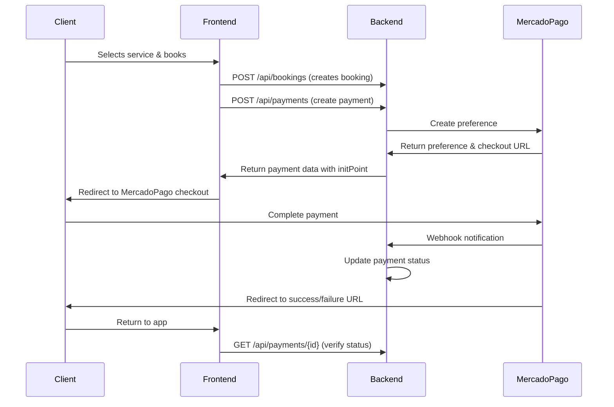
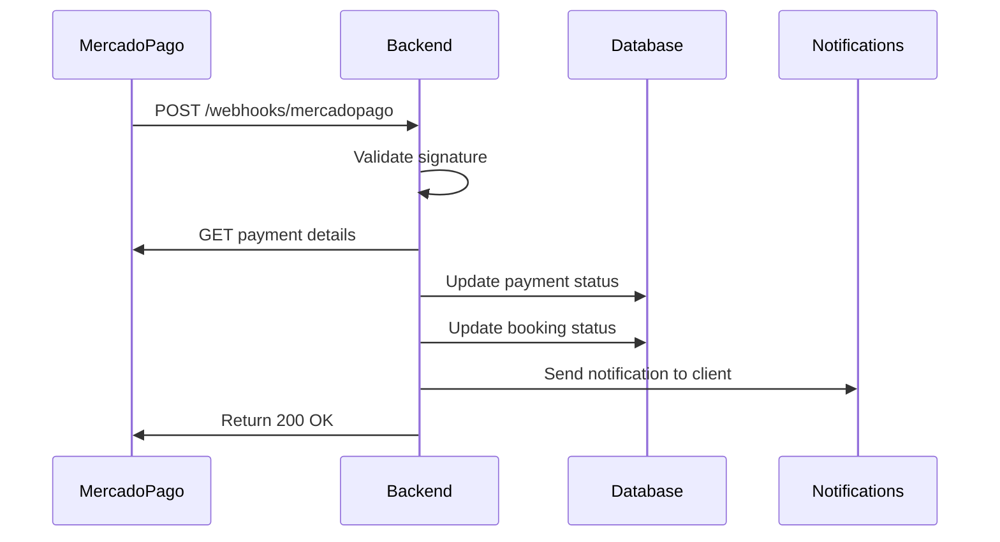

# BarberPro Payment Integration Guide
## MercadoPago Integration for Argentina Market

### Overview
This guide provides comprehensive documentation for integrating with the BarberPro payment system, which uses MercadoPago as the primary payment gateway for the Argentina market.

## Table of Contents
1. [API Endpoints](#api-endpoints)
2. [Payment Flow](#payment-flow)
3. [Frontend Integration](#frontend-integration)
4. [Security Considerations](#security-considerations)
5. [Error Handling](#error-handling)
6. [Testing](#testing)
7. [Argentina-Specific Features](#argentina-specific-features)

## API Endpoints

### 1. Get Payment Configuration
```http
GET /api/payments/config
```

**Response:**
```json
{
  "success": true,
  "data": {
    "publicKey": "TEST-your-public-key",
    "environment": "sandbox",
    "currency": "ARS",
    "maxInstallments": 12,
    "supportedMethods": [
      "credit_card",
      "debit_card",
      "bank_transfer",
      "rapipago",
      "pagofacil",
      "account_money"
    ]
  }
}
```

### 2. Create Payment
```http
POST /api/payments
Authorization: Bearer <jwt_token>
Content-Type: application/json
```

**Request Body:**
```json
{
  "bookingId": "clm1234567890abcdef",
  "amount": 2500.00,
  "currency": "ARS",
  "paymentMethod": "credit_card",
  "installments": 3,
  "description": "Corte de cabello y barba - BarberShop Central",
  "clientEmail": "cliente@example.com",
  "clientName": "Juan Carlos Pérez",
  "clientPhone": "+5491123456789",
  "clientDni": "12345678",
  "returnUrls": {
    "success": "https://barberpro.com.ar/payment/success",
    "failure": "https://barberpro.com.ar/payment/failure",
    "pending": "https://barberpro.com.ar/payment/pending"
  },
  "metadata": {
    "source": "mobile_app",
    "campaign": "new_user_discount"
  }
}
```

**Response (201 Created):**
```json
{
  "success": true,
  "data": {
    "id": "clm0987654321fedcba",
    "status": "pending",
    "preferenceId": "123456789-12345678-1234567890abcdef",
    "initPoint": "https://www.mercadopago.com.ar/checkout/v1/redirect?pref_id=123456789-12345678-1234567890abcdef",
    "sandboxInitPoint": "https://sandbox.mercadopago.com.ar/checkout/v1/redirect?pref_id=123456789-12345678-1234567890abcdef",
    "externalReference": "clm1234567890abcdef",
    "createdAt": "2023-12-01T10:30:00.000Z"
  }
}
```

### 3. Get Payment Status
```http
GET /api/payments/{paymentId}
Authorization: Bearer <jwt_token>
```

**Response:**
```json
{
  "success": true,
  "data": {
    "id": "clm0987654321fedcba",
    "status": "PAID",
    "amount": 2500.00,
    "currency": "ARS",
    "paymentMethod": "credit_card",
    "externalId": "mp-payment-12345",
    "createdAt": "2023-12-01T10:30:00.000Z",
    "paidAt": "2023-12-01T10:35:00.000Z",
    "booking": {
      "id": "clm1234567890abcdef",
      "clientId": "client-id",
      "providerId": "provider-id",
      "serviceId": "service-id"
    }
  }
}
```

### 4. Process Refund
```http
POST /api/payments/{paymentId}/refund
Authorization: Bearer <jwt_token>
Content-Type: application/json
```

**Request Body:**
```json
{
  "amount": 1000.00,
  "reason": "Client cancellation within 24 hours"
}
```

### 5. Get Payment Analytics
```http
GET /api/payments/analytics?from=2023-01-01&to=2023-12-31&providerId=provider-id
Authorization: Bearer <jwt_token>
```

## Payment Flow

### 1. Client-Side Flow


### 2. Backend Webhook Flow


## Frontend Integration

### 1. Initialize Payment Configuration
```typescript
// services/payment.ts
import { PaymentConfig } from '../types/payment';

export class PaymentService {
  private config: PaymentConfig | null = null;

  async getConfig(): Promise<PaymentConfig> {
    if (!this.config) {
      const response = await fetch('/api/payments/config');
      const result = await response.json();
      this.config = result.data;
    }
    return this.config;
  }

  async createPayment(request: CreatePaymentRequest): Promise<PaymentResponse> {
    const response = await fetch('/api/payments', {
      method: 'POST',
      headers: {
        'Content-Type': 'application/json',
        'Authorization': `Bearer ${getAuthToken()}`,
      },
      body: JSON.stringify(request),
    });

    if (!response.ok) {
      throw new Error('Payment creation failed');
    }

    return response.json();
  }
}
```

### 2. Payment Component (Svelte)
```svelte
<!-- PaymentForm.svelte -->
<script lang="ts">
  import { PaymentService } from '../services/payment';
  import { goto } from '$app/navigation';
  
  export let booking: Booking;
  
  let paymentService = new PaymentService();
  let loading = false;
  let error = '';

  async function processPayment() {
    loading = true;
    error = '';

    try {
      const config = await paymentService.getConfig();
      
      const paymentRequest = {
        bookingId: booking.id,
        amount: booking.totalAmount,
        currency: 'ARS',
        description: `${booking.service.name} - ${booking.provider.businessName}`,
        clientEmail: booking.client.email,
        clientName: booking.client.name,
        clientPhone: booking.client.phone,
        clientDni: booking.client.dni,
        returnUrls: {
          success: `${window.location.origin}/payment/success`,
          failure: `${window.location.origin}/payment/failure`,
          pending: `${window.location.origin}/payment/pending`,
        },
      };

      const payment = await paymentService.createPayment(paymentRequest);
      
      // Redirect to MercadoPago checkout
      const checkoutUrl = config.environment === 'sandbox' 
        ? payment.data.sandboxInitPoint 
        : payment.data.initPoint;
        
      window.location.href = checkoutUrl;
    } catch (err) {
      error = 'Error al procesar el pago. Intente nuevamente.';
      console.error('Payment error:', err);
    } finally {
      loading = false;
    }
  }
</script>

<div class="payment-form">
  <h3>Completar Pago</h3>
  
  <div class="payment-summary">
    <p><strong>Servicio:</strong> {booking.service.name}</p>
    <p><strong>Proveedor:</strong> {booking.provider.businessName}</p>
    <p><strong>Monto:</strong> ${booking.totalAmount.toLocaleString('es-AR')} ARS</p>
  </div>

  {#if error}
    <div class="error-message">{error}</div>
  {/if}

  <button 
    on:click={processPayment} 
    disabled={loading}
    class="pay-button"
  >
    {loading ? 'Procesando...' : 'Pagar con MercadoPago'}
  </button>
</div>
```

### 3. Payment Status Verification
```typescript
// utils/paymentVerification.ts
export async function verifyPaymentStatus(paymentId: string): Promise<PaymentStatus> {
  const response = await fetch(`/api/payments/${paymentId}`, {
    headers: {
      'Authorization': `Bearer ${getAuthToken()}`,
    },
  });

  if (!response.ok) {
    throw new Error('Failed to verify payment status');
  }

  const result = await response.json();
  return result.data;
}

// In your success page component
export async function handlePaymentReturn(paymentId: string) {
  try {
    const payment = await verifyPaymentStatus(paymentId);
    
    if (payment.status === 'PAID') {
      // Payment successful
      showSuccessMessage();
      updateBookingStatus(payment.booking.id);
    } else if (payment.status === 'PENDING') {
      // Payment pending (bank transfer, etc.)
      showPendingMessage();
    } else {
      // Payment failed
      showErrorMessage();
    }
  } catch (error) {
    console.error('Error verifying payment:', error);
    showErrorMessage();
  }
}
```

## Security Considerations

### 1. Authentication
- All payment endpoints require JWT authentication
- Users can only create/view payments for their own bookings
- Providers can process refunds for their services

### 2. Data Validation
- Server-side validation for all payment requests
- Input sanitization to prevent injection attacks
- Amount validation and currency verification

### 3. PCI DSS Compliance
- No sensitive payment data stored on servers
- All card processing handled by MercadoPago
- Secure webhook signature validation

### 4. Rate Limiting
- Payment endpoints have enhanced rate limiting
- 10 requests per 15 minutes per IP/user combination
- Webhook endpoints have IP whitelisting

## Error Handling

### Common Error Codes
```typescript
interface PaymentError {
  code: string;
  message: string;
  details?: any;
}

// Error codes and handling
const errorHandlers = {
  'VALIDATION_ERROR': 'Datos de pago inválidos',
  'BOOKING_NOT_FOUND': 'Reserva no encontrada',
  'PAYMENT_ALREADY_EXISTS': 'El pago ya fue procesado',
  'UNAUTHORIZED': 'No autorizado para realizar esta acción',
  'GATEWAY_ERROR': 'Error del procesador de pagos',
  'INSUFFICIENT_FUNDS': 'Fondos insuficientes',
  'CARD_EXPIRED': 'Tarjeta vencida',
  'INVALID_CARD': 'Datos de tarjeta inválidos',
};
```

### Error Handling in Frontend
```typescript
async function handlePaymentError(error: PaymentError): Promise<void> {
  const userMessage = errorHandlers[error.code] || 'Error desconocido';
  
  // Log for debugging
  console.error('Payment error:', error);
  
  // Show user-friendly message
  showErrorToast(userMessage);
  
  // Track error for analytics
  trackEvent('payment_error', {
    code: error.code,
    message: error.message,
  });
}
```

## Testing

### 1. Test Credentials
```env
# Test environment
MERCADOPAGO_ENVIRONMENT=sandbox
MERCADOPAGO_ACCESS_TOKEN_TEST=TEST-your-test-token
MERCADOPAGO_PUBLIC_KEY_TEST=TEST-your-test-public-key
```

### 2. Test Credit Cards (MercadoPago Sandbox)
```javascript
const testCards = {
  visa: {
    number: '4509953566233704',
    cvv: '123',
    expiration: '11/25',
    name: 'APRO', // Auto-approval
  },
  mastercard: {
    number: '5031755734530604',
    cvv: '123',
    expiration: '11/25',
    name: 'APRO',
  },
  // Test rejection
  rejected: {
    number: '4509953566233704',
    cvv: '123',
    expiration: '11/25',
    name: 'OTHE', // Will be rejected
  },
};
```

### 3. Running Tests
```bash
# Run payment integration tests
npm test tests/integration/payments.test.ts

# Run with coverage
npm run test:coverage
```

## Argentina-Specific Features

### 1. Payment Methods
- **Credit/Debit Cards**: Visa, Mastercard, American Express
- **Bank Transfer**: All major Argentina banks
- **Cash Networks**: Rapipago, Pago Fácil
- **MercadoPago Wallet**: Account money

### 2. Installments (Cuotas)
```typescript
// Configure installments for Argentina market
const installmentOptions = {
  maxInstallments: 12,
  interestFree: 3, // First 3 installments without interest
  bankPromotions: true, // Enable bank-specific promotions
};
```

### 3. Tax Handling
- 21% IVA (VAT) included in service prices
- Tax withholding for service providers
- AFIP integration (future implementation)

### 4. Commission Structure
- Standard: 3.5% platform commission
- High Volume (50+ bookings/month): 2.8%
- Premium providers: 2.5%
- 10-day hold period before provider payout

### 5. Currency and Formatting
```typescript
// Argentina peso formatting
const formatCurrency = (amount: number): string => {
  return new Intl.NumberFormat('es-AR', {
    style: 'currency',
    currency: 'ARS',
    minimumFractionDigits: 2,
  }).format(amount);
};

// Example: formatCurrency(2500) => "$2.500,00"
```

## Best Practices

### 1. User Experience
- Show payment progress clearly
- Provide multiple payment options
- Handle slow network conditions gracefully
- Implement payment retry mechanisms

### 2. Security
- Never log sensitive payment data
- Validate all inputs server-side
- Use HTTPS for all payment communications
- Implement proper session management

### 3. Performance
- Cache payment configuration
- Minimize API calls during checkout
- Implement proper loading states
- Use optimistic UI updates where appropriate

### 4. Error Recovery
- Provide clear error messages in Spanish
- Offer alternative payment methods on failure
- Implement automatic retry logic
- Allow users to contact support easily

## Support and Troubleshooting

### Common Issues
1. **Payment stuck in pending**: Check webhook configuration
2. **Invalid signature errors**: Verify webhook secret
3. **Rate limit exceeded**: Implement exponential backoff
4. **Currency mismatch**: Always use ARS for Argentina

### Monitoring
- Payment success rate should be > 95%
- Average response time < 5 seconds
- Monitor webhook delivery success
- Track payment method preferences

### Contact
- Technical Support: tech@barberpro.com.ar
- Payment Issues: payments@barberpro.com.ar
- MercadoPago Support: https://www.mercadopago.com.ar/ayuda

---

*This documentation is maintained by the BarberPro development team and updated regularly to reflect the latest integration requirements and best practices.*