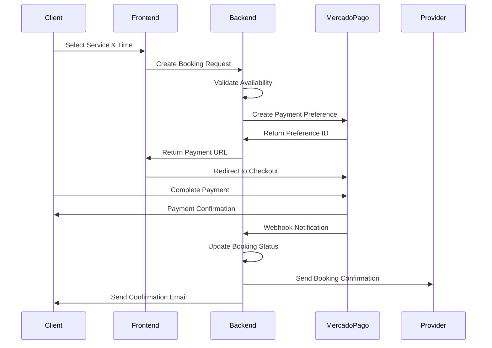

# MercadoPago Payment Integration - BarberPro

**Version:** 1.0  
**Date:** September 10, 2025  
**Author:** Payment Integration Specialist  

## Executive Summary

This document outlines the comprehensive payment integration strategy for BarberPro using MercadoPago as the primary payment gateway for the Argentina market. The integration supports service bookings, commission management, and subscription billing while ensuring compliance with Argentina's financial regulations.

## 1. MercadoPago Account Setup & Configuration

### 1.1 Developer Account Requirements

**Business Entity Setup:**
- **Business Type:** Marketplace/Platform (commission-based services)
- **Industry:** Personal Care Services / Beauty & Wellness
- **Geographic Focus:** Argentina (primary), with LATAM expansion capability
- **Transaction Volume:** Estimated 10,000+ monthly transactions at full scale

**Required Documentation:**
- CUIT/CUIL business registration
- Bank account information for payouts
- Business license for service marketplace operations
- Tax identification (AFIP registration)

**Account Verification Process:**
1. Create MercadoPago business account
2. Complete identity verification with DNI/passport
3. Provide business documentation (CUIT registration)
4. Bank account verification for fund transfers
5. Tax compliance verification (AFIP integration)

### 1.2 API Credentials Management

**Environment Setup:**
```env
# Production Environment
MERCADOPAGO_ACCESS_TOKEN=APP_USR-production-access-token
MERCADOPAGO_PUBLIC_KEY=APP_PUB-production-public-key
MERCADOPAGO_WEBHOOK_SECRET=webhook-secret-key

# Staging Environment  
MERCADOPAGO_ACCESS_TOKEN_TEST=TEST-access-token
MERCADOPAGO_PUBLIC_KEY_TEST=TEST-public-key
MERCADOPAGO_WEBHOOK_SECRET_TEST=test-webhook-secret
```

**Security Requirements:**
- Store credentials in secure environment variables
- Rotate keys quarterly for production
- Use different credentials for staging/production
- Implement secure key management with AWS Secrets Manager or equivalent

### 1.3 Webhook Endpoint Configuration

**Webhook URLs:**
- **Production:** `https://api.barberpro.com.ar/webhooks/mercadopago`
- **Staging:** `https://staging-api.barberpro.com.ar/webhooks/mercadopago`
- **Local Development:** `https://ngrok-url.ngrok.io/api/webhooks/mercadopago`

**Webhook Events Subscription:**
- `payment` - Payment status updates
- `plan` - Subscription plan changes (for future features)
- `invoice` - Billing events
- `subscription` - Subscription lifecycle events

## 2. Payment Integration Architecture

### 2.1 Integration Options Analysis

**Selected Approach: Checkout Pro (Recommended)**

**Advantages for BarberPro:**
- Fastest implementation (2-3 days vs 1-2 weeks for custom)
- MercadoPago handles PCI compliance
- Built-in fraud protection
- Mobile-optimized experience
- Supports all Argentina payment methods
- Guest checkout capability
- Saved payment method support

**Implementation Flow:**
```
Client Booking Request → Create Payment Preference → Redirect to MercadoPago → 
Payment Completion → Webhook Notification → Update Booking Status → 
Provider Notification → Commission Calculation
```

**Alternative Considered: Custom Checkout**
- More control over UX but significantly higher development effort
- Requires additional PCI compliance measures
- Recommended for future premium features

### 2.2 Payment Flow Architecture



### 2.3 Database Schema Design

**Payment Records Table:**
```sql
CREATE TABLE payments (
    id UUID PRIMARY KEY DEFAULT gen_random_uuid(),
    booking_id UUID REFERENCES bookings(id),
    mercadopago_payment_id VARCHAR(255) UNIQUE,
    preference_id VARCHAR(255),
    amount DECIMAL(10,2) NOT NULL,
    currency VARCHAR(3) DEFAULT 'ARS',
    status payment_status NOT NULL,
    payment_method_type VARCHAR(50),
    payment_type_id VARCHAR(50),
    platform_commission DECIMAL(10,2),
    gateway_fees DECIMAL(10,2),
    net_amount DECIMAL(10,2),
    created_at TIMESTAMP DEFAULT NOW(),
    updated_at TIMESTAMP DEFAULT NOW(),
    processed_at TIMESTAMP,
    
    INDEX idx_booking_id (booking_id),
    INDEX idx_mp_payment_id (mercadopago_payment_id),
    INDEX idx_status (status),
    INDEX idx_created_at (created_at)
);

CREATE TYPE payment_status AS ENUM (
    'pending',
    'approved', 
    'authorized',
    'in_process',
    'in_mediation',
    'rejected',
    'cancelled',
    'refunded',
    'charged_back'
);
```

**Commission Tracking Table:**
```sql
CREATE TABLE commissions (
    id UUID PRIMARY KEY DEFAULT gen_random_uuid(),
    payment_id UUID REFERENCES payments(id),
    provider_id UUID REFERENCES users(id),
    gross_amount DECIMAL(10,2) NOT NULL,
    commission_rate DECIMAL(5,4) NOT NULL, -- 0.0350 for 3.5%
    commission_amount DECIMAL(10,2) NOT NULL,
    gateway_fees DECIMAL(10,2) NOT NULL,
    net_payout DECIMAL(10,2) NOT NULL,
    status commission_status DEFAULT 'pending',
    hold_until TIMESTAMP NOT NULL, -- 10 days from payment
    paid_at TIMESTAMP,
    created_at TIMESTAMP DEFAULT NOW()
);

CREATE TYPE commission_status AS ENUM (
    'pending',
    'held',
    'ready_for_payout',
    'paid',
    'disputed'
);
```

## 3. Detailed Payment Flows

### 3.1 Successful Payment Flow

**Step-by-Step Implementation:**

1. **Booking Initiation**
   ```typescript
   // Frontend: Service selection and booking request
   const bookingRequest = {
     serviceId: 'service-uuid',
     providerId: 'provider-uuid',
     startTime: '2025-09-15T10:00:00Z',
     duration: 60, // minutes
     totalAmount: 2500.00 // ARS
   };
   ```

2. **Payment Preference Creation**
   ```typescript
   // Backend: Create MercadoPago preference
   const preference = {
     items: [{
       title: 'Corte de Cabello - Juan Pérez',
       quantity: 1,
       unit_price: 2500.00,
       currency_id: 'ARS'
     }],
     back_urls: {
       success: 'https://barberpro.com.ar/booking/success',
       failure: 'https://barberpro.com.ar/booking/failure',
       pending: 'https://barberpro.com.ar/booking/pending'
     },
     notification_url: 'https://api.barberpro.com.ar/webhooks/mercadopago',
     external_reference: bookingId,
     payment_methods: {
       excluded_payment_types: [],
       excluded_payment_methods: [],
       installments: 12 // Allow installments
     }
   };
   ```

3. **Payment Processing**
   - Client redirected to MercadoPago Checkout Pro
   - Completes payment with preferred method
   - MercadoPago processes payment and security checks

4. **Webhook Processing**
   ```typescript
   // Webhook handler for payment notifications
   app.post('/api/webhooks/mercadopago', async (request, reply) => {
     const signature = request.headers['x-signature'];
     const dataId = request.body.data.id;
     
     // Verify webhook signature
     if (!verifyWebhookSignature(signature, request.body)) {
       return reply.status(401).send('Unauthorized');
     }
     
     // Fetch payment details from MercadoPago
     const payment = await mercadopago.payment.findById(dataId);
     
     // Update booking and payment records
     await updatePaymentStatus(payment);
     await updateBookingStatus(payment.external_reference, payment.status);
     
     reply.status(200).send('OK');
   });
   ```

### 3.2 Payment Failure Handling

**Failure Scenarios & Recovery:**

1. **Insufficient Funds**
   - Display user-friendly error message
   - Offer alternative payment methods
   - Retain booking for 15 minutes for retry

2. **Card Declined**
   - Provide specific error feedback
   - Suggest contacting bank
   - Offer different payment method options

3. **Technical Failures**
   - Implement exponential backoff for API calls
   - Fallback to manual payment processing
   - Automatic retry mechanism (up to 3 attempts)

**Implementation:**
```typescript
const handlePaymentFailure = async (bookingId: string, errorReason: string) => {
  // Update booking status to 'payment_failed'
  await updateBookingStatus(bookingId, 'payment_failed');
  
  // Send notification to client with retry options
  await sendPaymentFailureNotification(bookingId, errorReason);
  
  // Hold booking slot for 15 minutes
  await holdBookingSlot(bookingId, 15);
  
  // Log failure for analysis
  logger.error('Payment failure', { bookingId, errorReason });
};
```

### 3.3 Refund Processing

**Refund Scenarios:**
- Client-initiated cancellation (>24 hours: full refund, <24 hours: 50% refund)
- Provider cancellation (full refund)
- Service dispute resolution (partial/full refund)

**Implementation:**
```typescript
const processRefund = async (paymentId: string, amount?: number) => {
  const payment = await getPaymentById(paymentId);
  const refundAmount = amount || payment.amount;
  
  // Create refund in MercadoPago
  const refund = await mercadopago.refund.create({
    payment_id: payment.mercadopago_payment_id,
    amount: refundAmount
  });
  
  // Update local records
  await createRefundRecord({
    paymentId,
    refundAmount,
    mercadopagoRefundId: refund.id,
    reason: 'client_cancellation'
  });
  
  return refund;
};
```

## 4. Argentina-Specific Implementation

### 4.1 Supported Payment Methods

**Primary Payment Methods:**
- **Credit Cards:** Visa, Mastercard, American Express (12 installments available)
- **Debit Cards:** Visa Debit, Mastercard Debit (instant payment)
- **Digital Wallets:** Mercado Pago account balance
- **Bank Transfers:** Transferencias bancarias online
- **Cash Payments:** Rapipago, Pago Fácil (offline payments)

**Implementation Configuration:**
```typescript
const paymentMethodsConfig = {
  credit_cards: {
    installments: {
      min: 1,
      max: 12
    }
  },
  debit_cards: {
    enabled: true
  },
  account_money: {
    enabled: true
  },
  ticket: {
    enabled: true,
    expiry_days: 3
  }
};
```

### 4.2 Currency & Pricing Considerations

**Currency Handling:**
- All transactions in Argentine Pesos (ARS)
- Real-time currency conversion for provider analytics
- Inflation-adjusted pricing recommendations

**Pricing Display:**
```typescript
const formatCurrency = (amount: number): string => {
  return new Intl.NumberFormat('es-AR', {
    style: 'currency',
    currency: 'ARS',
    minimumFractionDigits: 2
  }).format(amount);
};

// Example: formatCurrency(2500) → "$2.500,00"
```

### 4.3 Tax Compliance (AFIP Integration)

**Required Tax Handling:**
- VAT (IVA) calculation: 21% for services
- Withholding tax for providers (varies by classification)
- Electronic invoice generation (factura electrónica)

**Implementation Plan:**
```typescript
const calculateTaxes = (amount: number, providerTaxStatus: string) => {
  const iva = amount * 0.21;
  const retentions = calculateWithholdings(amount, providerTaxStatus);
  
  return {
    gross: amount,
    iva,
    retentions,
    net: amount - retentions
  };
};
```

## 5. Commission & Fee Management

### 5.1 BarberPro Commission Structure

**Commission Rates:**
- **Standard:** 3.5% per transaction
- **High Volume:** 2.8% (>100 bookings/month)
- **Premium Subscription:** 2.5% (Premium provider plan)

**Fee Calculation:**
```typescript
const calculateCommission = (amount: number, providerTier: ProviderTier): Commission => {
  const rates = {
    standard: 0.035,
    high_volume: 0.028,
    premium: 0.025
  };
  
  const commissionRate = rates[providerTier];
  const commissionAmount = amount * commissionRate;
  const gatewayFees = calculateMercadoPagoFees(amount);
  
  return {
    grossAmount: amount,
    commissionRate,
    commissionAmount,
    gatewayFees,
    netPayout: amount - commissionAmount - gatewayFees
  };
};
```

### 5.2 Payout Management

**Payout Schedule:**
- **Hold Period:** 10 days from payment completion
- **Payout Frequency:** Daily (for available funds)
- **Minimum Payout:** $1,000 ARS
- **Maximum Daily Payout:** $500,000 ARS

**Implementation:**
```typescript
const processPayouts = async () => {
  const readyPayouts = await getReadyPayouts();
  
  for (const payout of readyPayouts) {
    try {
      // Transfer funds to provider account
      const transfer = await createBankTransfer(payout);
      await markPayoutAsCompleted(payout.id, transfer.id);
    } catch (error) {
      await markPayoutAsFailed(payout.id, error.message);
    }
  }
};
```

## 6. Security & Risk Management

### 6.1 Payment Security Measures

**Implementation Requirements:**
- SSL/TLS encryption for all payment communications
- Webhook signature verification
- Payment amount validation
- Rate limiting for payment endpoints
- PCI DSS compliance (handled by MercadoPago)

**Code Implementation:**
```typescript
const verifyWebhookSignature = (signature: string, payload: any): boolean => {
  const expectedSignature = crypto
    .createHmac('sha256', process.env.MERCADOPAGO_WEBHOOK_SECRET)
    .update(JSON.stringify(payload))
    .digest('hex');
    
  return crypto.timingSafeEqual(
    Buffer.from(signature),
    Buffer.from(expectedSignature)
  );
};
```

### 6.2 Fraud Prevention

**Risk Assessment Implementation:**
```typescript
const assessPaymentRisk = async (payment: PaymentData): Promise<RiskLevel> => {
  const factors = {
    newUser: await isFirstTimeUser(payment.userId),
    highAmount: payment.amount > 10000, // ARS
    velocityCheck: await checkPaymentVelocity(payment.userId),
    deviceFingerprint: payment.deviceId
  };
  
  let riskScore = 0;
  if (factors.newUser) riskScore += 2;
  if (factors.highAmount) riskScore += 3;
  if (factors.velocityCheck) riskScore += 4;
  
  return riskScore > 5 ? 'HIGH' : riskScore > 2 ? 'MEDIUM' : 'LOW';
};
```

## 7. Testing Strategy

### 7.1 MercadoPago Test Environment

**Test Credentials Setup:**
```javascript
const testConfig = {
  accessToken: 'TEST-access-token',
  publicKey: 'TEST-public-key',
  baseURL: 'https://api.mercadopago.com'
};
```

**Test Payment Methods:**
- **Approved Card:** 5031 7557 3453 0604
- **Rejected Card:** 5031 7557 3453 0611
- **Pending Card:** 5031 7557 3453 0629

### 7.2 Comprehensive Test Scenarios

**Critical Test Cases:**

1. **Successful Payment Flow**
   - Create booking → Generate payment → Complete payment → Receive webhook → Update status

2. **Payment Failure Scenarios**
   - Insufficient funds → Card declined → Network timeout

3. **Refund Processing**
   - Full refund → Partial refund → Refund failure

4. **Commission Calculations**
   - Standard rate → High volume rate → Premium rate

5. **Payout Processing**
   - Hold period compliance → Payout execution → Payout failure

**Automated Test Suite:**
```typescript
describe('Payment Integration', () => {
  test('should create payment preference successfully', async () => {
    const booking = await createTestBooking();
    const preference = await createPaymentPreference(booking);
    
    expect(preference.id).toBeDefined();
    expect(preference.sandbox_init_point).toContain('mercadopago');
  });
  
  test('should handle webhook notifications', async () => {
    const webhookPayload = createTestWebhookPayload();
    const response = await request(app)
      .post('/api/webhooks/mercadopago')
      .send(webhookPayload);
      
    expect(response.status).toBe(200);
  });
});
```

## 8. Integration Timeline & Dependencies

### 8.1 Development Timeline

**Day 1: Research & Setup** ✓
- MercadoPago account creation and verification
- API credentials configuration
- Integration architecture planning

**Days 10-11: Backend Integration (Dependent on Ticket B1-001)**
- Install MercadoPago SDK
- Implement payment preference creation
- Setup webhook handling
- Database schema creation and migrations

**Days 12-13: Frontend Integration (Dependent on Ticket F1-001)**
- Payment form implementation
- MercadoPago redirect integration
- Success/failure page creation
- Mobile payment flow optimization

**Day 14: Testing & Validation**
- End-to-end payment flow testing
- Commission calculation validation
- Security testing and vulnerability assessment

### 8.2 Technical Dependencies

**Backend Dependencies:**
- Fastify server setup (Ticket B1-001)
- PostgreSQL database with Prisma ORM
- Redis for caching and session management
- JWT authentication system

**Frontend Dependencies:**
- SvelteKit project setup (Ticket F1-001)
- TailwindCSS styling framework
- Form validation and state management
- Mobile-responsive design components

**Infrastructure Dependencies:**
- SSL certificates and domain configuration (Ticket O1-001)
- Environment variable management
- Webhook endpoint accessibility
- Database backup and monitoring

## 9. Production Readiness Checklist

### 9.1 Pre-Launch Requirements

**Technical Checklist:**
- [ ] MercadoPago production account verified
- [ ] SSL certificates installed and validated
- [ ] Webhook endpoints tested and monitored
- [ ] Payment flow end-to-end testing completed
- [ ] Commission calculations verified
- [ ] Refund process tested
- [ ] Security penetration testing passed
- [ ] Load testing for payment endpoints
- [ ] Error handling and logging implemented
- [ ] Monitoring and alerting configured

**Compliance Checklist:**
- [ ] AFIP tax integration completed
- [ ] Argentina financial regulations compliance
- [ ] PCI DSS requirements validated
- [ ] Privacy policy updated for payment data
- [ ] Terms of service include payment terms
- [ ] Provider payout agreements signed

**Business Checklist:**
- [ ] Commission structure configured
- [ ] Payout schedules established
- [ ] Customer support trained on payment issues
- [ ] Refund and dispute procedures documented
- [ ] Financial reconciliation processes defined

## 10. Monitoring & Analytics

### 10.1 Key Metrics Tracking

**Payment Metrics:**
- Payment success rate (target: >95%)
- Average payment processing time (target: <30 seconds)
- Payment method distribution
- Transaction volume by time period
- Commission revenue tracking

**Business Metrics:**
- Provider payout satisfaction
- Payment dispute resolution time
- Customer payment experience ratings
- Revenue per booking
- Platform commission effectiveness

### 10.2 Alerting & Monitoring

**Critical Alerts:**
- Payment success rate drops below 90%
- Webhook processing failures
- High-value payment failures
- Unusual payment patterns (fraud detection)
- Payout processing failures

**Implementation:**
```typescript
const monitorPaymentHealth = async () => {
  const metrics = await calculatePaymentMetrics();
  
  if (metrics.successRate < 0.90) {
    await sendAlert('CRITICAL', 'Payment success rate below 90%');
  }
  
  if (metrics.avgProcessingTime > 30000) {
    await sendAlert('WARNING', 'Payment processing time high');
  }
};
```

## Conclusion

This comprehensive payment integration strategy positions BarberPro for success in the Argentina market with a secure, scalable, and user-friendly payment system. The MercadoPago integration provides excellent coverage of local payment preferences while maintaining compliance with financial regulations.

The phased implementation approach ensures minimal risk while delivering core payment functionality quickly. The architecture supports future enhancements including subscription billing, advanced fraud detection, and expansion to other Latin American markets.

**Next Steps:**
1. Complete MercadoPago developer account verification
2. Begin backend integration development (Days 10-11)
3. Coordinate with frontend team for payment flow implementation
4. Execute comprehensive testing plan before production deployment

---

**Document Status:** ✅ Complete  
**Review Required:** Backend Developer, Tech Lead  
**Implementation Start:** Day 10 (Post Backend Foundation)